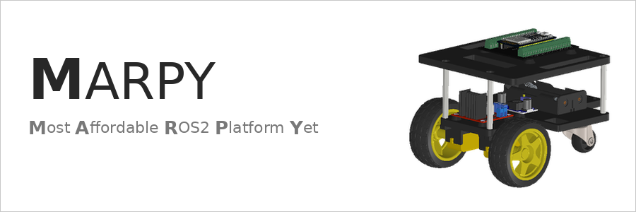

<p align="center">
  
</p>

<div align="center">

[](https://ubuntu.com/) [](https://docs.ros.org/en/jazzy/) [](https://micro.ros.org/) [](LICENSE)

</div>

A cheap, open-source, 3D-printed differential-drive robot designed for beginners who want to learn ROS2 with real hardware.

---

## Requirements

- Ubuntu 24.04
- ROS2 Jazzy (or Docker)
- PlatformIO (for flashing the ESP32)
- WiFi network (2.4 GHz - ESP32 doesn't support 5 GHz)

## Quick Start

### 1. Clone the workspace

```bash
git clone https://github.com/LevinTamir/MARPY.git marpy_ws
cd marpy_ws
```

### 2. Build the robot

Follow the guides in order:

| Step | Guide | Description |
|------|-------|-------------|
| 1 | [Bill of Materials](docs/bom.md) | Buy the parts (< 50$) |
| 2 | [Assembly Instructions](docs/assembly.md) | Build the robot |
| 3 | [Wiring Guide](docs/wiring.md) | Connect all the electronics |
| 4 | [Firmware Setup](docs/firmware-setup.md) | Flash the ESP32 with micro-ROS |
| 5 | [ROS2 Setup](docs/ros2-setup.md) | Set up your PC and start driving! |
| 6 | [Simulation](docs/simulation.md) | Run MARPY in Gazebo (no hardware needed) |

### 3. Drive!

```bash
# Terminal 1: Start the micro-ROS agent
docker run -it --rm --net=host microros/micro-ros-agent:jazzy udp4 --port 8888 -v6

# Terminal 2: Drive with keyboard teleop
sudo apt install ros-jazzy-teleop-twist-keyboard
ros2 run teleop_twist_keyboard teleop_twist_keyboard
```


## Repository Structure

```
marpy_ws/
├── README.md               ← You are here
├── docs/
│   ├── bom.md              ← Bill of materials + purchase links
│   ├── assembly.md         ← Step-by-step build guide
│   ├── wiring.md           ← Wiring diagram + pin tables
│   ├── firmware-setup.md   ← Flash the ESP32
│   ├── ros2-setup.md       ← ROS2 + micro-ROS agent setup
│   └── images/             ← Robot photos and diagrams
├── src/
│   ├── marpy_description/  ← URDF model + meshes + Gazebo worlds
│   ├── marpy_localization/ ← Wheel odometry + path tracking
│   └── marpy_bringup/      ← Launch files (sim + real)
├── docker/
│   ├── docker-compose.yml  ← micro-ROS agent + dev container
│   ├── Dockerfile          ← ROS2 Jazzy dev environment
│   └── entrypoint.sh
├── CAD/                    ← STL files for 3D printing
└── .github/workflows/      ← CI/CD pipeline
```

## Firmware Repository

The ESP32 firmware lives in a separate repo:

**[marpy_firmware](https://github.com/LevinTamir/marpy_firmware)** - PlatformIO project with micro-ROS, motor control, and encoder reading.

## ROS2 Topics

| Topic | Type | Direction | Rate |
|-------|------|-----------|------|
| `/cmd_vel` | `geometry_msgs/Twist` | PC → ESP32 | On demand |
| `/joint_states` | `sensor_msgs/JointState` | ESP32 → PC | 20 Hz |
| `/odom` | `nav_msgs/Odometry` | Odometry node | 20 Hz |
| `/odom_path` | `nav_msgs/Path` | Odometry node | 20 Hz |


## Contributing

Contributions are welcome! If you build a MARPY robot, open an issue with photos - we'd love to see it.
