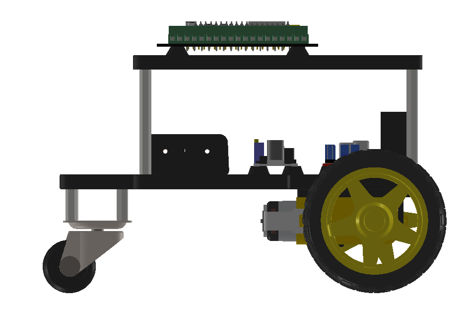
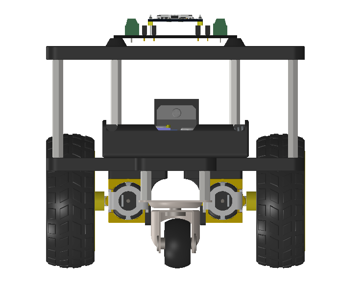
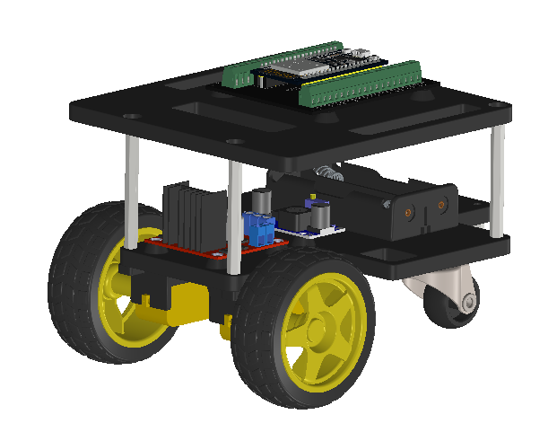

# Assembly Instructions

Step-by-step guide to build your MERPY robot.

## What You'll Need

- All parts from the [Bill of Materials](bom.md)
- 3D printed parts from the [`CAD/`](../CAD/) folder
- Basic tools: screwdriver, soldering iron, wire strippers

## Step 1: Print the Chassis Parts

Print the following parts (see [`CAD/`](../CAD/) for STL files):

| Part | Layer Height | Infill | Supports |
|------|-------------|--------|----------|
| Bottom Deck | 0.2mm | 20% | No |
| Top Deck | 0.2mm | 20% | No |
| Caster Mount | 0.2mm | 30% | Yes |
| Motor Clamps (if needed) | 0.2mm | 30% | No |

## Step 2: Mount the Motors

1. Press-fit or screw the two DC gear motors into the bottom deck motor mounts
2. Ensure both motors face outward with shafts protruding through the side holes
3. Press the yellow TT wheels onto the motor shafts

## Step 3: Attach the Caster Wheel

1. Screw the caster wheel into the caster mount bracket
2. Attach the caster mount to the rear of the bottom deck using M3 screws

## Step 4: Install the Electronics (Bottom Deck)

1. Mount the **L298N motor driver** to the bottom deck using M3 screws or double-sided tape
2. Place the **battery holder** in the center of the bottom deck
3. Mount the **buck converter** near the L298N

## Step 5: Wire the Power

1. Connect the battery holder output to the L298N `+12V` and `GND` inputs
2. Connect the battery holder output to the buck converter input
3. **Remove** the ENA and ENB jumpers from the L298N

See [Wiring Guide](wiring.md) for the full wiring diagram.

## Step 6: Wire the Motors

For each motor, connect:
- Motor power wires → L298N outputs (OUT1/OUT2 for right, OUT3/OUT4 for left)
- Encoder VCC → 5V (from buck converter)
- Encoder GND → common ground
- Encoder A/B → ESP32 GPIOs (see [Wiring Guide](wiring.md))

## Step 7: Install the Top Deck

1. Screw the 4 standoff posts into the bottom deck corners
2. Place the top deck on the standoffs and secure with M3 nuts

## Step 8: Mount the ESP32

1. Mount the ESP32 DevKit on the top deck (use pin headers or a breadboard for easy access)
2. Connect all control wires from the L298N and encoders (see [Wiring Guide](wiring.md))
3. Connect 5V from the buck converter to ESP32 VIN and GND

## Step 9: Flash and Test

1. Connect the ESP32 to your PC via USB
2. Follow the [Firmware Setup](firmware-setup.md) guide to flash micro-ROS
3. Follow the [ROS2 Setup](ros2-setup.md) guide to start driving!

## Safety Tips

- Always test with the robot wheels off the ground first
- Double-check polarity before connecting the battery
- The L298N can get warm - don't cover it
- Keep the ESP32 USB port accessible for debugging
