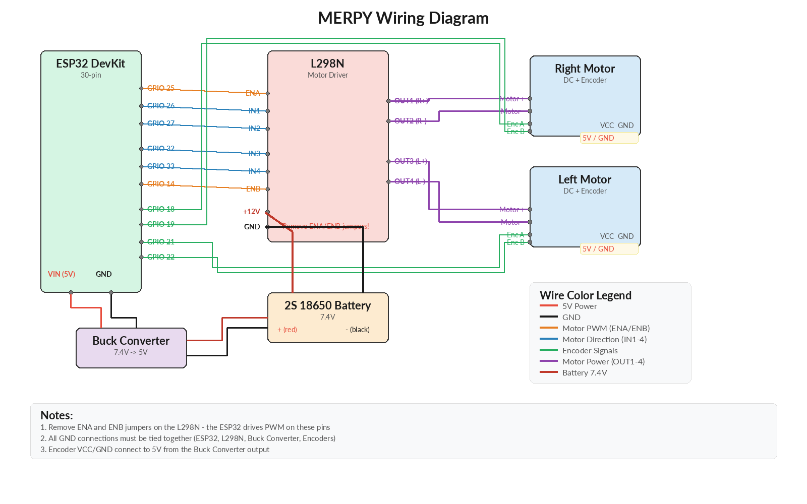
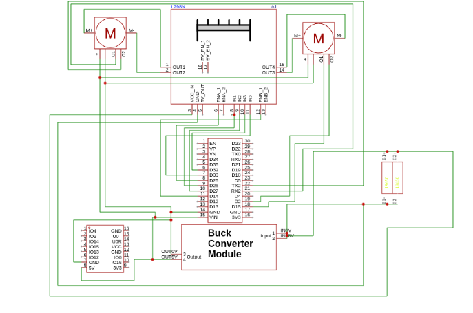

# Wiring Guide

> [!CAUTION]
> **NEVER connect the ESP32 to your PC via USB while the robot's batteries are switched ON.** The battery power will back-feed through the ESP32's VIN into your computer's USB port. This can damage your PC, the ESP32, or both. **Always turn off the battery switch before plugging in a USB cable** for flashing firmware, serial monitoring, or any other reason. To be safe, **disconnect the batteries entirely**.

This guide covers all electrical connections for the MARPY robot. Make sure you've completed the [Assembly](assembly.md) first - all components should be physically mounted before wiring.

## Wiring Diagram

## Full Schematic

## Step 1: Power Distribution

1. **Battery Pack** (2S 18650, ~7.4V) connects through the on/off switch to:
   - L298N `+12V` input (powers the motors directly)
   - Buck converter input

2. **Buck Converter** (7.4V -> 5V) connects to:
   - ESP32 `VIN` pin (5V)
   - Encoder VCC lines (5V)

3. **Ground:** All GND connections must be **common** - ESP32 GND, L298N GND, buck converter GND, encoder GND all tied together.

> **Tip:** Set the buck converter output to **5V** using a multimeter before connecting the ESP32.

## Step 2: Motor Control Wiring (ESP32 to L298N)

| ESP32 GPIO | L298N Pin | Function |
|-----------|-----------|----------|
| GPIO 25 | ENA | Right motor speed (PWM) |
| GPIO 26 | IN1 | Right motor direction A |
| GPIO 27 | IN2 | Right motor direction B |
| GPIO 32 | IN3 | Left motor direction A |
| GPIO 33 | IN4 | Left motor direction B |
| GPIO 14 | ENB | Left motor speed (PWM) |

> **Important:** Remove the ENA and ENB jumpers on the L298N board. These pins must be driven by the ESP32 PWM, not tied to 5V.

## Step 3: Motor Wiring (L298N to Motors)

Each DC gear motor has 6 wires:

| Wire Color | Label | Connection |
|-----------|-------|-----------|
| Red | M+ | L298N OUT1/OUT3 (motor power +) |
| Blue | M- | L298N OUT2/OUT4 (motor power -) |
| Green | VCC | 5V (encoder power) |
| Black | GND | GND (encoder ground) |
| Yellow | C1 | ESP32 GPIO - Encoder Channel A (see table below) |
| White | C2 | ESP32 GPIO - Encoder Channel B (see table below) |

> **Tip:** If a motor spins the wrong direction, swap its M+ (red) and M- (blue) wires at the L298N output. If an encoder counts in the wrong direction, swap its C1 (yellow) and C2 (white) channels.

## Step 4: Encoder Wiring

| Motor Wire | Color | ESP32 GPIO | Function |
|-----------|-------|-----------|----------|
| C1 | Yellow | GPIO 18 | Right encoder - Channel A |
| C2 | White | GPIO 19 | Right encoder - Channel B |
| VCC | Green | 5V (buck converter) | Right encoder power |
| GND | Black | GND | Right encoder ground |
| C1 | Yellow | GPIO 21 | Left encoder - Channel A |
| C2 | White | GPIO 22 | Left encoder - Channel B |
| VCC | Green | 5V (buck converter) | Left encoder power |
| GND | Black | GND | Left encoder ground |

## Step 5: IMU Wiring (MPU6050)

The MPU6050 IMU connects to the ESP32 via I2C. Since the default I2C pins (GPIO 21/22) are used by the encoders, we use GPIO 13 (SDA) and GPIO 15 (SCL).

| MPU6050 Pin | Connection |
|------------|-----------|
| VCC | 3.3V (from ESP32 3V3 pin) |
| GND | GND (common ground) |
| SDA | ESP32 GPIO 13 |
| SCL | ESP32 GPIO 15 |

> **Important:** The MPU6050 runs on **3.3V**. Connect VCC to the ESP32's 3V3 pin, **not** 5V. AD0 and INT can be left unconnected (AD0 defaults to GND internally, giving I2C address 0x68).

## Pre-Flight Checklist

Before powering on, verify:

- [ ] L298N ENA/ENB jumpers **removed**
- [ ] All grounds connected together
- [ ] Buck converter output reads ~5V with a multimeter
- [ ] ESP32 powers on when battery is connected
- [ ] MPU6050 VCC connected to **3.3V** (not 5V)
- [ ] Motors are free to spin (wheels off the ground for first test)

## Next Step

With all wiring complete, proceed to the [Firmware Setup](firmware-setup.md) to flash micro-ROS onto the ESP32.
